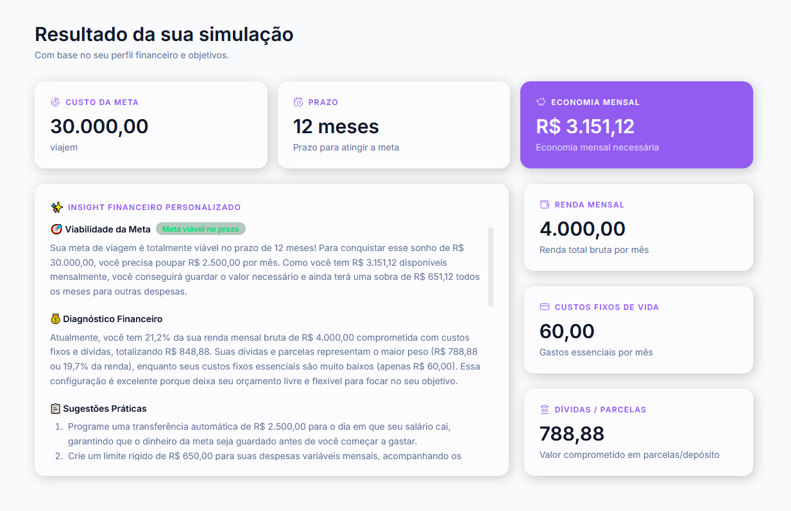
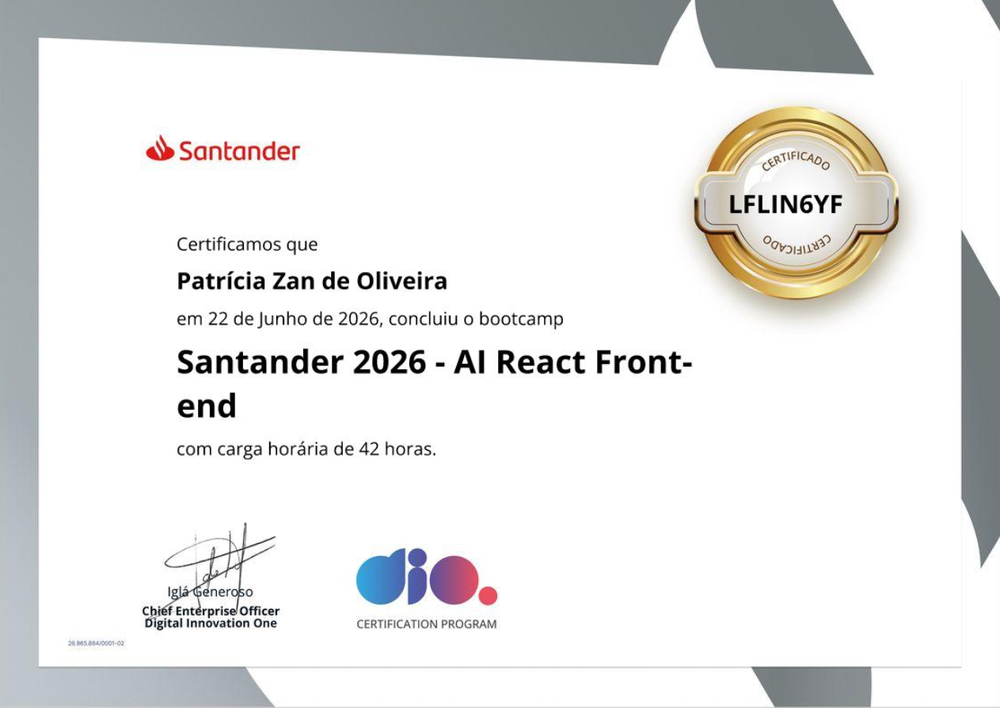

# Santander React Bootcamp 2024-2026

Bem-vindo ao repositório da trilha de React do **Santander Bootcamp 2026**. Este espaço documenta toda a jornada de aprendizado, desde os fundamentos de pacotes e renderização até a construção de aplicações complexas com Inteligência Artificial e TypeScript.

## 🛠️ Tecnologias e Ferramentas

O projeto utiliza o que há de mais moderno no ecossistema JavaScript/React:

- **Core:**  
- **Build Tools:**   
- **Estilização:**  
- **Gestão de Código:** 

## 📂 Estrutura do Repositório

O repositório é organizado de forma modular para facilitar o acompanhamento acadêmico:

1.  **`01-projeto-base`**: Estrutura inicial utilizando Vite e React.
2.  **`02-babel-webpack`**: Mergulho profundo em compiladores e empacotadores (configurações manuais).
3.  **`03-Exercicios`**: Laboratório de conceitos como Dark Mode, Props, Renderização de Listas e HOCs (High Order Components).
4.  **`04-Project` / `05-Inspiration-App`**: Aplicações intermediárias explorando hooks e modularização de estilos.
5.  **`06-Final-Project` (PiggyBank/Simulador)**: Uma ferramenta de simulação financeira com contextos, hooks customizados, separação de camadas (services/utils) e integração com IA.
6.  **`Certificates`**: Comprovação de conclusão das etapas e módulos do bootcamp.

## Projeto Final Pig Bank

Contido na pasta `06-Final-Project` foi construido utilizando as ferramentas:

  

Além de conter integração com a IA Gemini que realiza um resumo de como alcançar o objetivo proposto com os gastos e faturamentos do usuário.

<div align="center">
  
  
</div>

A aplicação final não é apenas visual, ela aplica padrões de arquitetura de software como:

- **Context API:** Gerenciamento de tema global.
- **Custom Hooks:** Lógica de persistência em `localStorage` e integração de simulador.
- **IA Service:** Prompts inteligentes para geração de insights financeiros baseados em dados do usuário.
- **Clean Code:** Separação clara entre componentes de Layout, Features e Shared.

---

### Como Executar os Projetos

Como o repositório contém múltiplos projetos independentes, siga estes passos:

1.  **Clone o repositório:**

    ```bash
    git clone https://github.com/PatriciaZan/Santander-React-Bootcamp-2026.git
    ```

2.  **Navegue até a pasta do projeto desejado:**

    ```bash
    cd 06-Final-Project
    ```

3.  **Instale as dependências:**

    ```bash
    npm install
    # ou
    npm i
    ```

4.  **Inicie o servidor de desenvolvimento:**
    ```bash
    npm run dev
    ```

## 🎓 Certificações Obtidas

<div align="center">
  

</div>

O repositório inclui certificados de módulos fundamentais, tais como:

- [x] Ambiente de Desenvolvimento React
- [x] Empacotadores e Compiladores
- [x] Componentes Funcionais e Props
- [x] Copilotos com IA no Desenvolvimento
- [x] E muitos outros...

## 👤 Autor

Desenvolvido por **Patrícia Zan** durante o bootcamp promovido pelo Santander em parceria com a DIO 2026.

[](https://www.linkedin.com/in/patriciazandeoliveira/)
[](https://github.com/PatriciaZan)
